# vrc.zip


A VRChat companion that runs on your own machine. It signs into more than one account at once, keeps
their presence live, records a feed you can search later, reads VRChat's game logs, and can hand that
same access to other apps you already use.

It opens in your browser, but nothing leaves your computer. Every port it binds is `127.0.0.1`.

> **UNOFFICIAL.** Not affiliated with, endorsed by, or operated by VRChat Inc. You sign in with your
> own VRChat credentials, and vrc.zip talks to VRChat as you.

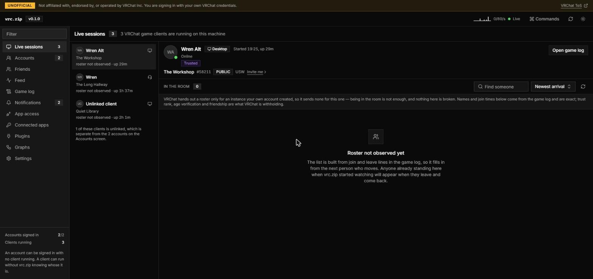

## Get it

Download `vrc.zip.exe` from [Releases](https://github.com/TheArmagan/vrc.zip/releases). One file,
nothing to install, nothing to put next to it. Windows x64 only for now.

Run it and it prints a link, then opens your browser on it:

```
  UI       http://127.0.0.1:7773  (the app)
  proxy    http://127.0.0.1:7774  (VRChat API mirror)
  control  http://127.0.0.1:7775  (consent, tokens, event stream)
  forward  http://127.0.0.1:7776  (configure an app with this)

  Open: http://127.0.0.1:7773/?token=...
```

The console window is not decoration. It carries that link, and closing it is how you stop the
daemon. The link has your session token in it, so treat it like a password.

## First run

1. **Settings, contact address.** VRChat requires every API client to put a working contact address
   in its User-Agent. Until you set an email or a profile URL there, sign-in fails with
   `setup_required`. vrc.zip sends nothing to VRChat other than the requests you cause.
2. **Accounts, Add account.** Username, password, then whichever second factor your account uses.
   All three work: authenticator app, email code, and the older `otp` path.
3. Add a second account if you have one. That is the normal case here, not an edge case.

Signing an account in does not launch VRChat, and quitting VRChat does not sign it out.

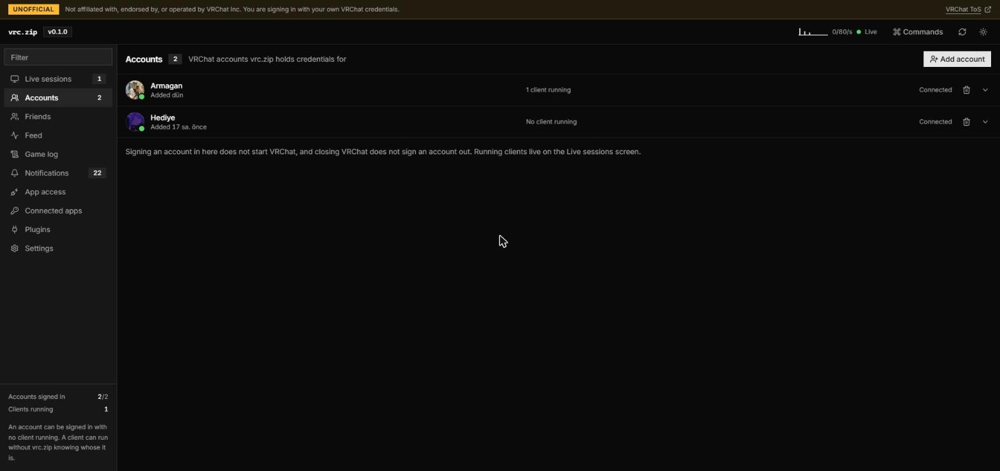

## What you get

### Live sessions

Every VRChat client running on this machine, read out of its log file: who it is signed in as, the
world, the instance, and who has walked in and out since vrc.zip started watching.

Two clients on two accounts show up as two sessions. A client signed into an account vrc.zip does not
manage still shows up, just without a name attached.

### Friends

All accounts in one list, grouped by status, with the world and instance each person is in and an
invite link where VRChat allows one.

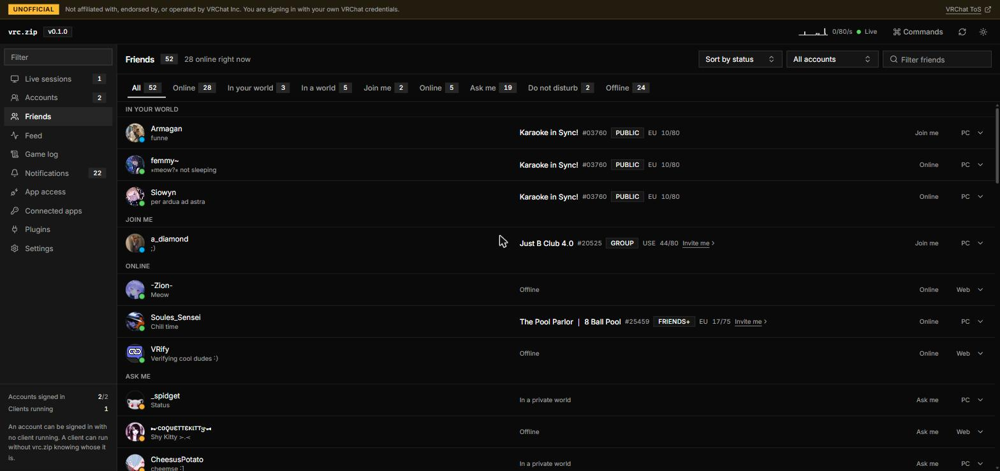

### Feed

One searchable history across every account: friends coming online, moving worlds, notifications,
game log lines, group activity. Filter by kind, by account, or by text.

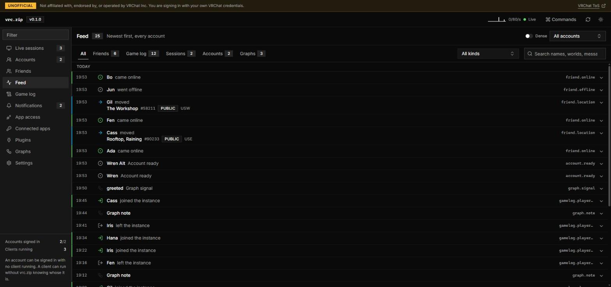

### Game log

The raw thing, parsed. Joins, leaves, world changes, instance changes, per client.

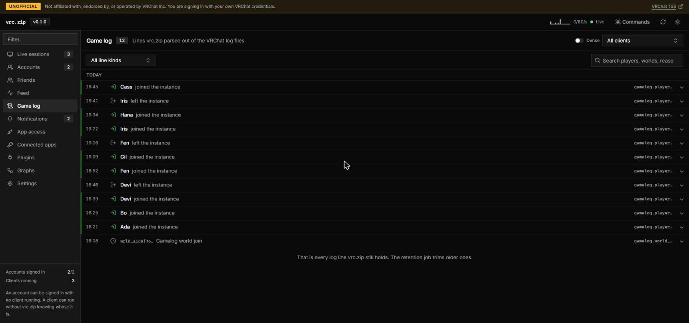

### Notifications

Friend requests, invites, group announcements and events, across accounts, in one place.

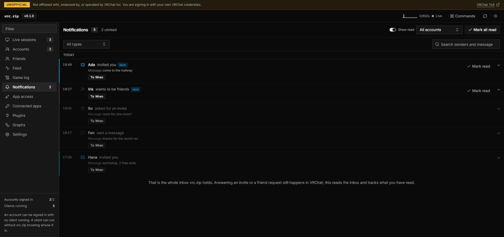

### History you control

Every kind of event has its own retention window, and you can see how many rows each one is holding
before you change it. Expiring events are folded into daily counts first, so the shape of your
history survives even when the individual rows do not. Notes, friend history, the avatar log and the
user cache are never deleted.

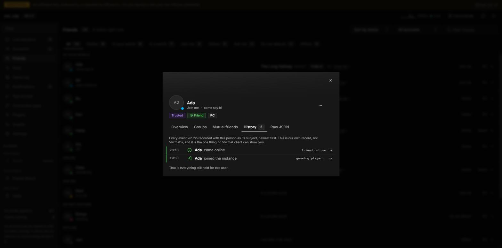

## Let your other apps use it

vrc.zip can stand in front of VRChat for other local apps, VRCX included. The app logs in the way it
always does, except the credentials it ends up holding are vrc.zip's, not VRChat's, and you decide
what it may do with them.

Point a proxy-aware app at `http://127.0.0.1:7776` and open that URL in a browser for the setup
steps, including the certificate it needs to trust.

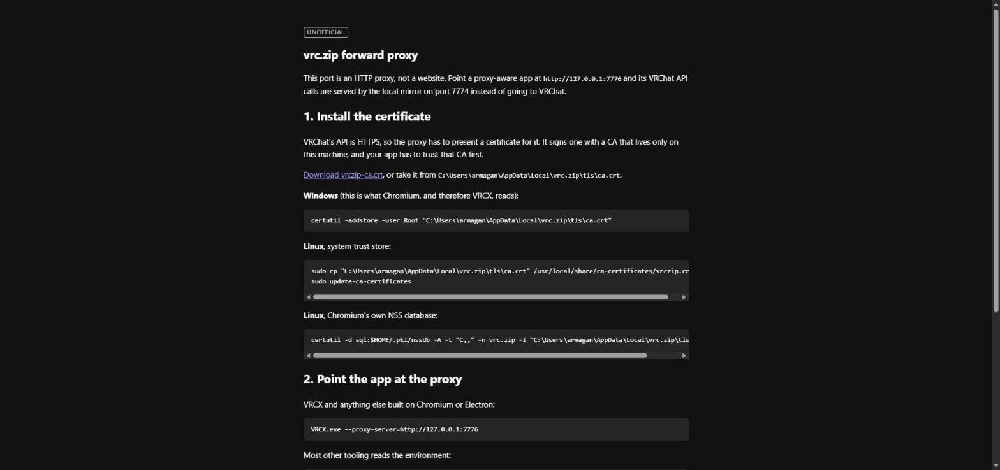

When the app logs in, vrc.zip shows you who is asking and what it wants. You approve by typing the
six-digit code into the app itself. There is no Allow button, on purpose.

Afterwards, **Connected apps** is the whole picture: which account it acts as, every permission it
holds with the risky ones marked, hourly limits you can tighten, what it has actually called
recently, and one button that cuts it off.

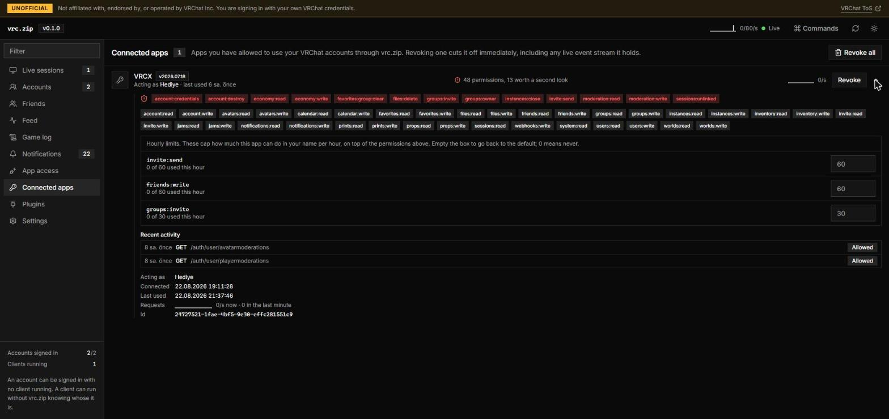

Your real VRChat session cookie never reaches the app. It cannot leave the daemon.

## Plugins

A plugin is a folder on your computer. There is no registry and no store. Install one and vrc.zip
compiles it, scans it, and shows you what it is asking for before anything runs.

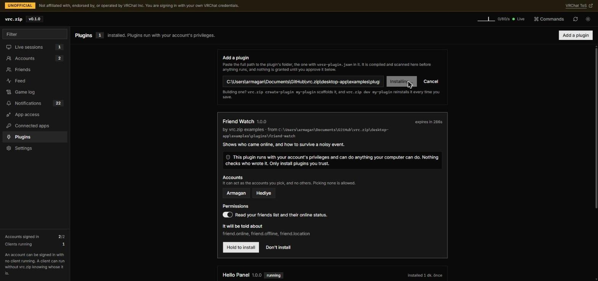

Read that warning and believe it: **a plugin runs with your account's privileges and can do anything
you can do on this computer.** Nothing sandboxes it, nothing checks who wrote it. The permission list
covers what it can ask vrc.zip for. It does not cover what it can do to your machine. Install
plugins you trust.

Plugins draw their own panel in the app and are enabled, disabled or removed from the same page.

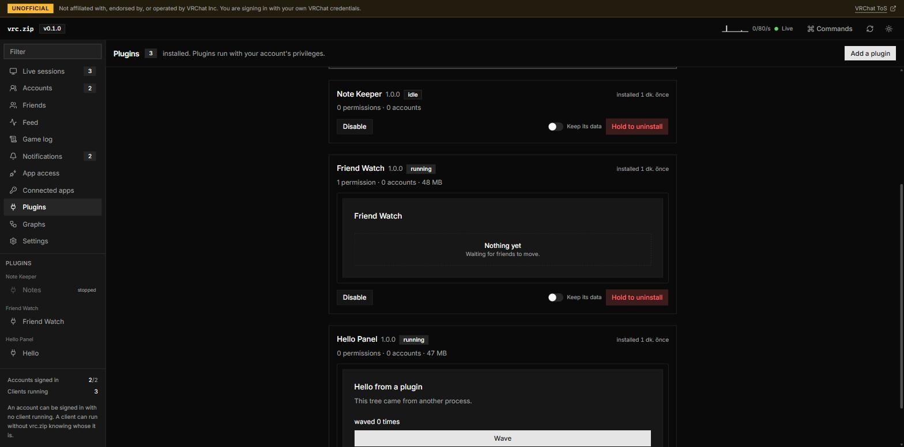

Writing one:

```
vrc.zip create-plugin my-plugin
cd my-plugin && bun install
vrc.zip dev .
```

`dev` reinstalls it every time you save.

## Where your things live

Everything is under `%LOCALAPPDATA%\vrc.zip`: the encrypted credential store, the SQLite database,
settings, and the proxy's certificate. Nothing is uploaded anywhere.

Passwords are not stored. Session cookies are, encrypted with a key held in Windows Credential
Manager.

## What it does not do

- **No packaged build outside Windows yet.** It runs from source anywhere Bun runs, and it knows
  where the logs live on Linux, Proton, Flatpak and Steam Deck, but the release is a Windows binary.
- **No node graph editor yet.** It is planned, it is not built.
- **No mobile, no remote access.** It binds to localhost only, and that is deliberate.
- **No monetization end-runs.** Favorite counts, invite slots and group limits are whatever your real
  VRC+ entitlements say. vrc.zip will not pretend otherwise.

It is version 0.1.0. Expect rough edges, and expect the database schema to move.

## Running from source

```bash
cd desktop-app
bun install
cd ui && bun run build && cd ..
bun run daemon
```

Bun 1.4.0. `desktop-app/PLAN.md` is the architecture and `desktop-app/PROGRESS.md` is the log of what
is built and what was decided along the way.

`backend/` in this repository is a separate project and is not part of the app.

## License

GPL-3.0. See [LICENSE](LICENSE).
