# vrc.zip


A VRChat companion that runs on your own machine. It signs into more than one account at once, keeps
their presence live, records a feed you can search later, reads VRChat's game logs, and can hand that
same access to other apps you already use.

It opens in your browser, but nothing leaves your computer. Every port it binds is `127.0.0.1`.

> **UNOFFICIAL.** Not affiliated with, endorsed by, or operated by VRChat Inc. You sign in with your
> own VRChat credentials, and vrc.zip talks to VRChat as you.

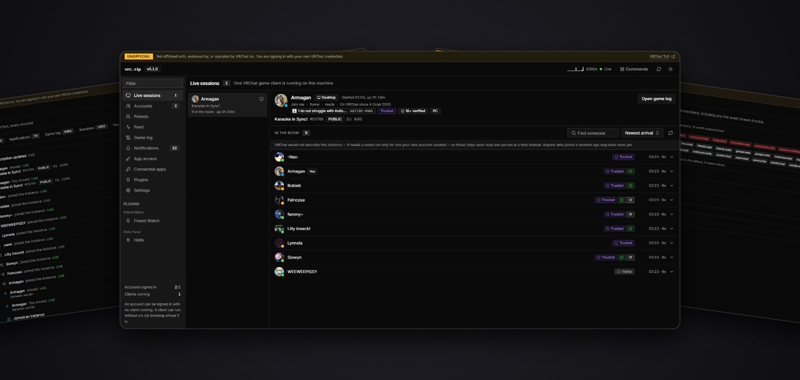

## Get it

Download `vrc.zip.exe` from [Releases](https://github.com/TheArmagan/vrc.zip/releases). One file,
nothing to install, nothing to put next to it. Windows x64 only for now.

Run it and it prints a link, then opens your browser on it:

```
  UI       http://127.0.0.1:7773  (the app)
  proxy    http://127.0.0.1:7774  (VRChat API mirror)
  control  http://127.0.0.1:7775  (consent, tokens, event stream)
  forward  http://127.0.0.1:7776  (configure an app with this)

  Open: http://127.0.0.1:7773/?token=...
```

The console window is not decoration. It carries that link, and closing it is how you stop the
daemon. The link has your session token in it, so treat it like a password.

## First run

1. **Settings, contact address.** VRChat requires every API client to put a working contact address
   in its User-Agent. Until you set an email or a profile URL there, sign-in fails with
   `setup_required`. vrc.zip sends nothing to VRChat other than the requests you cause.
2. **Accounts, Add account.** Username, password, then whichever second factor your account uses.
   All three work: authenticator app, email code, and the older `otp` path.
3. Add a second account if you have one. That is the normal case here, not an edge case.

Signing an account in does not launch VRChat, and quitting VRChat does not sign it out. Passwords are
never stored; the session cookie is, encrypted, and reused so VRChat is asked for a new session as
rarely as possible.

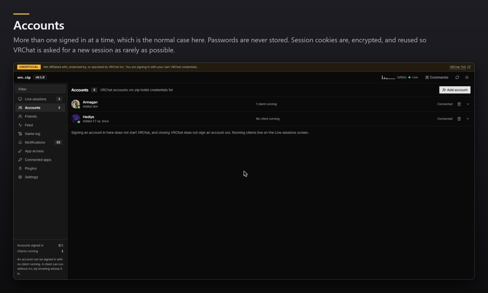

## What you get

### Live sessions

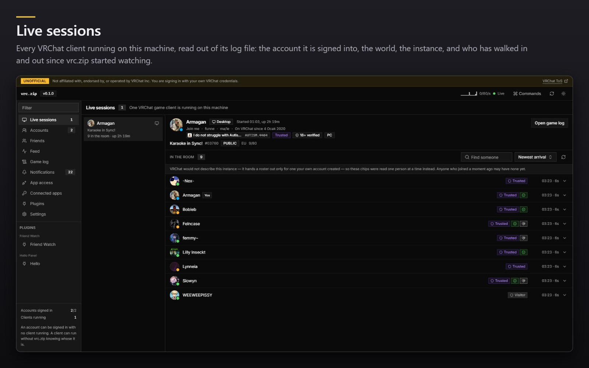

Two clients on two accounts show up as two sessions. A client signed into an account vrc.zip does not
manage still shows up, just without a name attached, because a session is the unit here and an
account is not.

### Friends

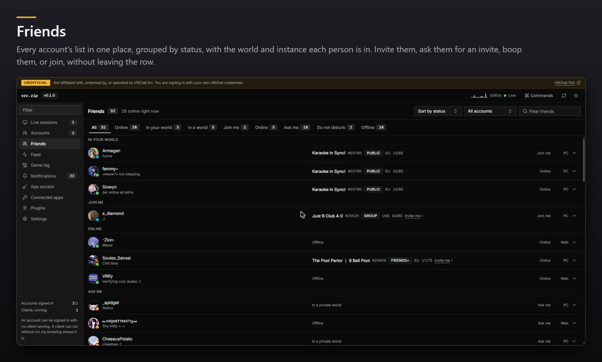

Presence comes off VRChat's own websocket rather than a poll, so a friend moving worlds lands in
front of you as it happens. The join button self-invites instead of opening a `vrchat://` link when a
client is already running on that account, since a second client on one account fights the first over
the game.

### Feed

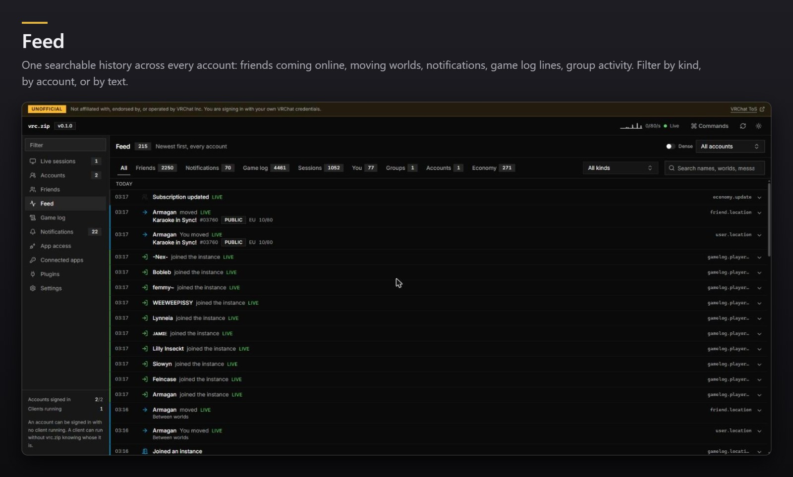

Rows link to the thing they mention. Profiles, worlds, groups and avatars open in the same panel with
a back stack, so following a name three levels deep still has a way back.

### Game log

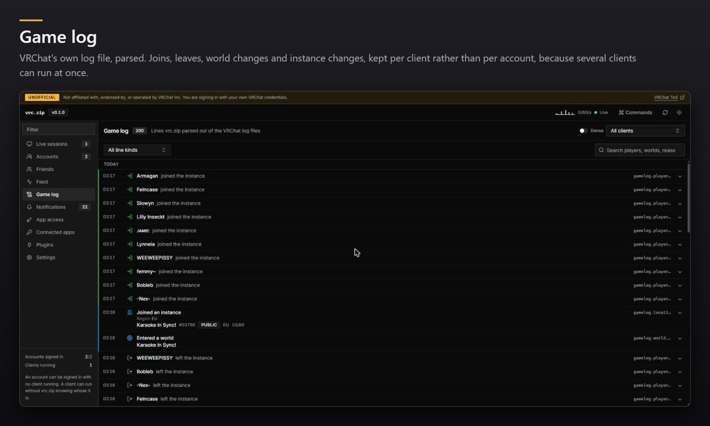

The parser reads the file VRChat is still writing to, by byte offset, so a running client is never
locked or interrupted. Every live log is tailed at once.

### Notifications

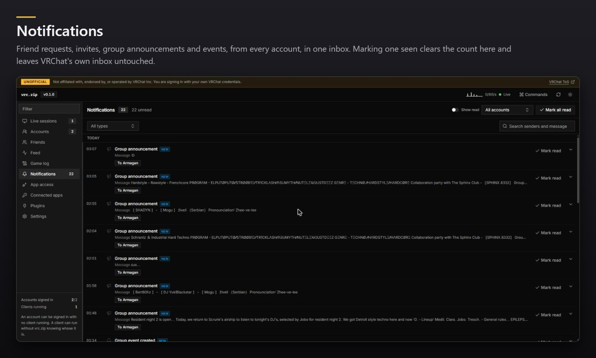

Everything that arrives while the daemon is running is written to the feed as well, so clearing the
inbox does not lose the history.

### Everything by keyboard

`Ctrl+Shift+P` opens the command palette. Every action in the app is in it, including the ones
plugins add, grouped by where they came from.

`Ctrl+Shift+V` takes whatever id or link is on your clipboard and opens it. A `usr_` out of a bug
report, a `wrld_` from Discord, a `vrchat://` copied out of the game. If the clipboard holds
something that is not an id, it says so instead of guessing.

### History you control

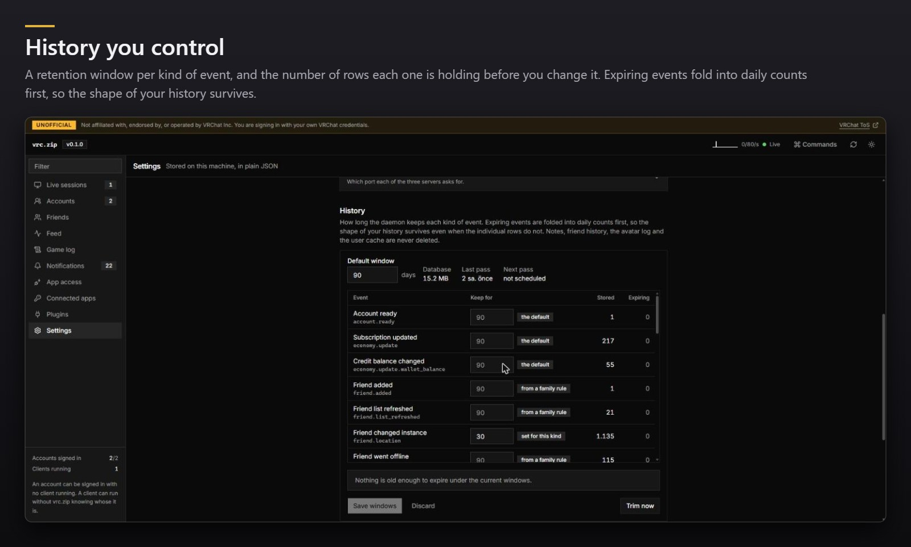

Notes, friend history, the avatar log and the user cache are outside all of it and are never deleted.

## Let your other apps use it

vrc.zip can stand in front of VRChat for other local apps, VRCX included. The app logs in the way it
always does, except the credentials it ends up holding are vrc.zip's, not VRChat's, and you decide
what it may do with them.

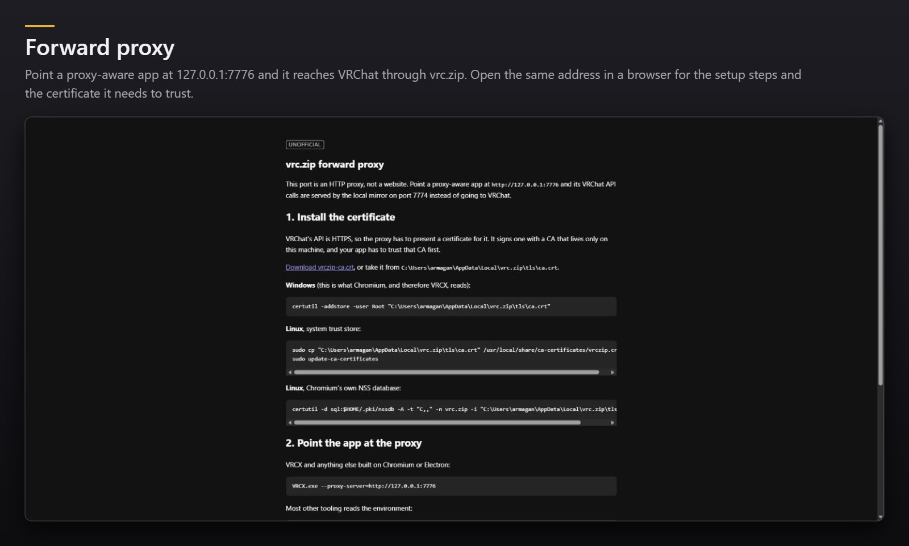

When the app logs in, vrc.zip shows you who is asking and what it wants. You approve by typing the
six-digit code into the app itself. There is no Allow button, on purpose.

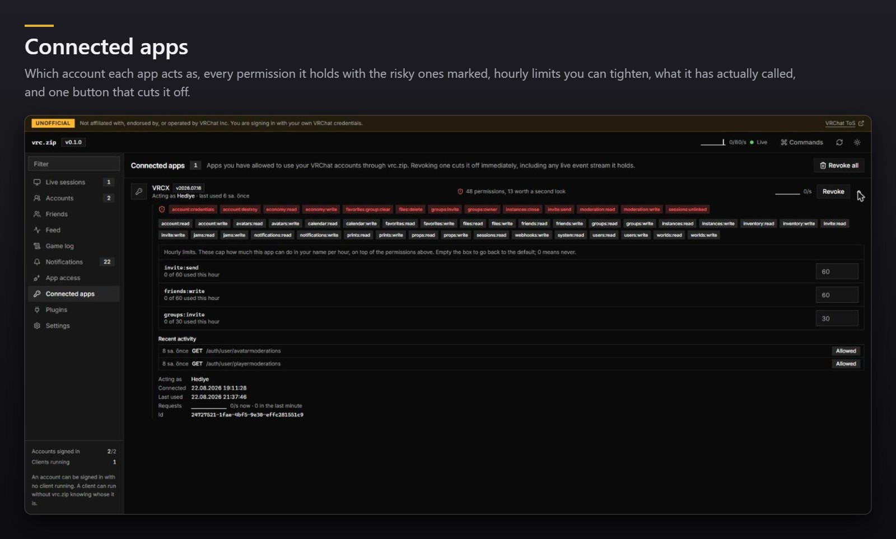

Revoking is immediate and takes the live event stream with it. One more button cuts off every app at
once. An app that wants to be told rather than to ask can register a webhook and get the same events
pushed to it. Your real VRChat session cookie never reaches any of them. It cannot leave the daemon.

## Plugins

Install one and vrc.zip compiles it, scans it, and shows you what it is asking for before any of its
code runs.

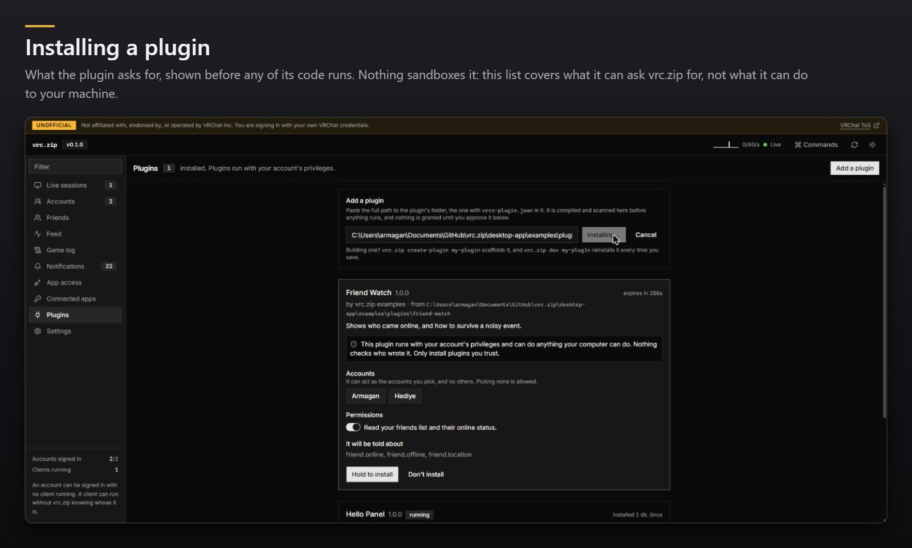

Read that warning and believe it: **a plugin runs with your account's privileges and can do anything
you can do on this computer.** Nothing sandboxes it, nothing checks who wrote it. The permission list
covers what it can ask vrc.zip for. It does not cover what it can do to your machine. Install
plugins you trust.

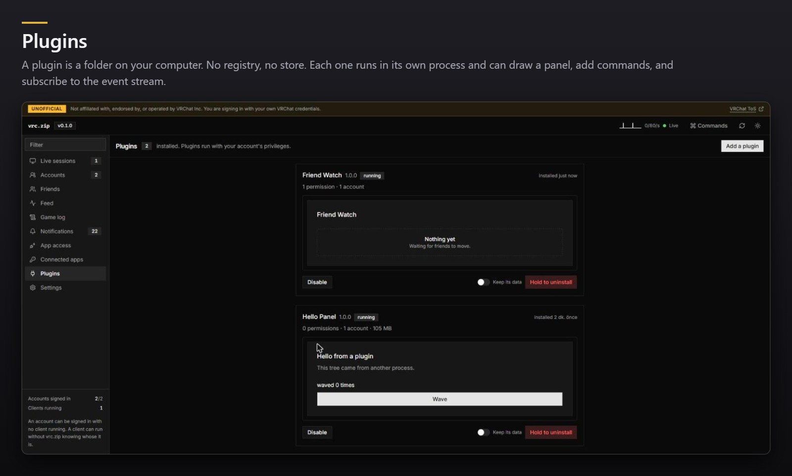

Writing one:

```
vrc.zip create-plugin my-plugin
cd my-plugin && bun install
vrc.zip dev .
```

`dev` reinstalls it every time you save.

## Where your things live

Everything is under `%LOCALAPPDATA%\vrc.zip`: the encrypted credential store, the SQLite database,
settings, and the proxy's certificate. Nothing is uploaded anywhere.

The key that encrypts the credential store is held by Windows Credential Manager, so the file is not
readable on its own.

One optional setting is the exception to "only VRChat". VRChat tells you what an avatar looks like
but never which avatar it is, so an avatar row has a picture and nothing to open. Turn on the avtr.zip
lookup and one image file id is sent there to get an avatar id back: no account, no cookie, no user
id, no display name. Leave it off and those rows stay unresolved.

## What it does not do

- **No packaged build outside Windows yet.** It runs from source anywhere Bun runs, and it knows
  where the logs live on Linux, Proton, Flatpak and Steam Deck, but the release is a Windows binary.
- **No node graph editor yet.** Plugins can already contribute node types. The canvas that wires them
  together is planned and not built.
- **No mobile, no remote access.** It binds to localhost only, and that is deliberate.
- **No monetization end-runs.** Favorite counts, invite slots and group limits are whatever your real
  VRC+ entitlements say. vrc.zip will not pretend otherwise.

It is version 0.1.0. Expect rough edges, and expect the database schema to move.

## Running from source

```bash
cd desktop-app
bun install
cd ui && bun run build && cd ..
bun run daemon
```

Bun 1.4.0. `desktop-app/PLAN.md` is the architecture and `desktop-app/PROGRESS.md` is the log of what
is built and what was decided along the way.

`backend/` in this repository is a separate project and is not part of the app.

## License

GPL-3.0. See [LICENSE](LICENSE).
